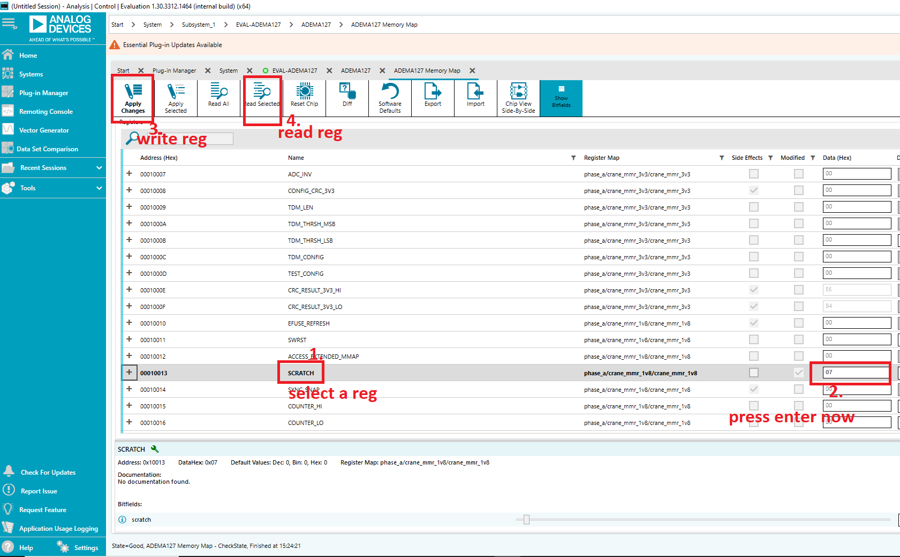
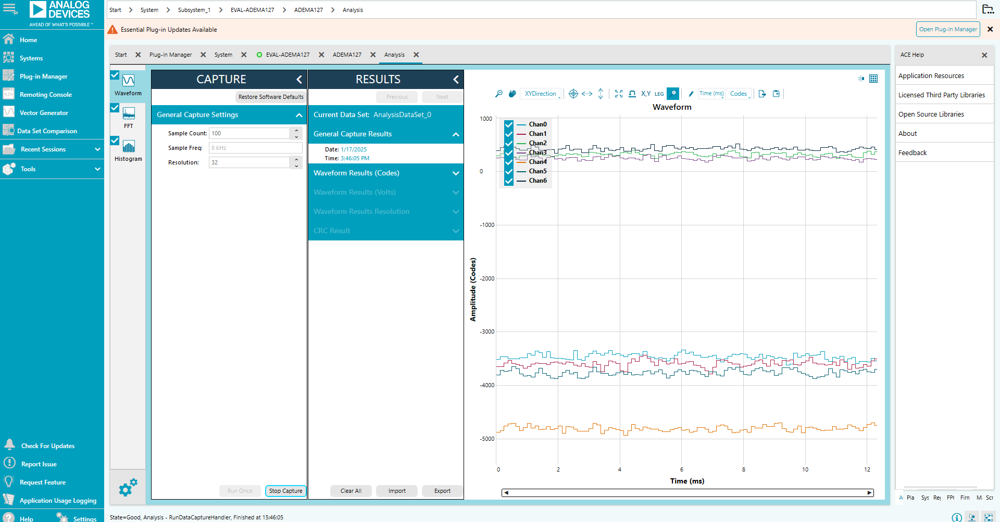
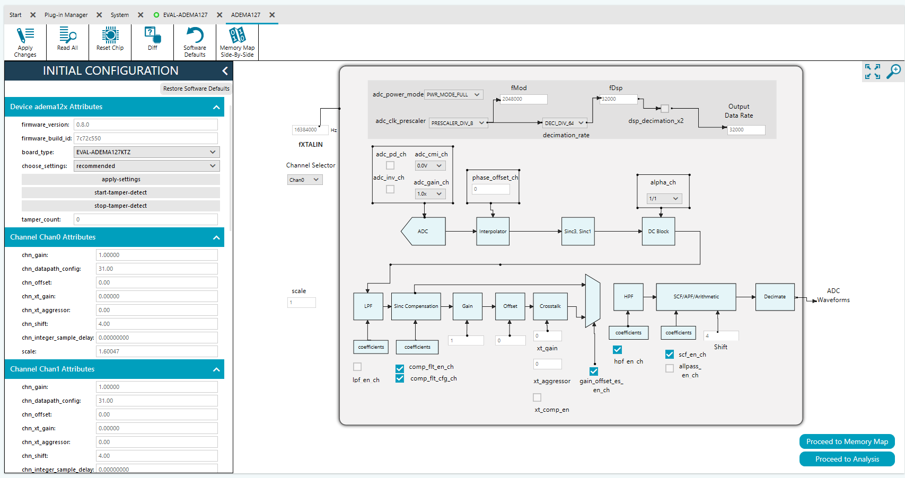


# ADEMA127 ACE Plugin User's Guide

## 1. PC & Software Setup

1. Get [EVAL-ADEMA127](https://www.analog.com/eval-adema127)
   - Connect App MCU Board as per the documentation given

2. **Install CP210x USB to UART Bridge Drivers**  
   - [Download](https://www.silabs.com/developer-tools/usb-to-uart-bridge-vcp-drivers) and install.
   - Connect board’s P7 port of App MCU Board to PC via micro USB.
   - Device appears as "Silicon Labs CP210x USB to UART Bridge" in Device Manager.

3. **Install ACE and Plugins**
   - [ACE Download](https://www.analog.com/ace)
   - Plugins: Board.ADEMA127, Chip.ADEMA127
   - See [ACE documentation](https://wiki.analog.com/resources/tools-software/ace) and [QuickStart](https://wiki.analog.com/resources/tools-software/ace/userguide/quickstart).
   - Pre-release plugins (ACEZIP) via [myAnalog](https://my.analog.com) (contact ADI).

4. **Recommended Versions**

   | Software | Version Tested |
   |:--------:| --------------:|
   | CP210x Drivers | 6.7.7.393 |
   | libiio driver | 0.25 |
   | ACE | 1.30 |
   
---

## 2. Programming the evaluation firmware on to the board

- The ACE does not support programming EVAL-ADEMA127. Firmware must be loaded manually using [STM32CubeProgrammer](https://www.st.com/en/development-tools/stm32cubeprog.html) and a hardware debugger such as [STLINK-V3SET](https://www.st.com/en/development-tools/stlink-v3set.html). 

1. **Connect the ST-Link Debugger:**
   - Connect the debugger’s SWD interface to the corresponding pins on the APP MCU Board.
   - Plug the debugger into your PC. The PC should detect the board as an STLINK port.

3. **Flash the Hex File:**
   
   - Firmware is located at **<plugin_install_directory>**\Board.ADEMA127.x.x.x\content\ace_firmware_gcc.hex.
   - The plugins are installed at **C:\ProgramData\Analog Devices\ACE\Plugins** unless you have set the plugins build folder to a different one during ACE installation.
   - Use the STM32CubeProgrammer GUI to flash the `.hex` file.
   - Alternatively, use the command line to load firmware using STM32CubeProgrammer:
     ```sh
     STM32_Programmer_CLI.exe -c port=SWD freq=4000 -d <path to .hex file> -g
     ```
- After loading inspect following LEDs:
  - **LED1 ON**: Firmware loaded.
  - **LED2 ON**: ADC initialized. If LED2 is OFF, check connections and reset MCU.

---


## 3. Configure serial communication settings

1. Open ACE.
2. Click 'Add Hardware'.
3. Go to 'Serial Ports' and click '+' to add:
   - Number: Port number of USB to UART bridge
   - Baudrate: 921600
   - Buffer Size: 64
   - Protocol: IIO
4. Click 'Ok'.
5. Reset the board
2. "EVAL_ADEMA127 Unverified" should appear in ACE within 3 seconds.
   - If not, click 'Refresh attached hardware' and wait up to 3 seconds.
3. Double-click the device to open the EVAL_ADEMA127 window, then double-click 'ADEMA127' to access the plugin.


---

## 4. Using the Plugin

### A. Register Access

1. Click `apply_settings` button to initialize ADC with recommended settings.
2. Read/write ADEMA127 registers in 'Proceed to Memory Map':
   

### B. Sample Collection & Analysis

- Click 'Proceed to Analysis' section.
- Up to 10,000 samples can be collected using 'Run Once':
  

---


## 6. Interactive Chip View



- **Chan Selector**: Choose one of 7 channels.
- **Gain/Offset/Shift/XtGain/XtAggressor**: Enter values for each channel.
- **Datapath Config**: Enable/disable options via checkboxes.
- **Scale**: Set scale in mV for analysis display.
- **Datarate Configuration**: Configure data rate using dropdowns; click 'Apply Changes'.
- **ADC**: Set adc_cmi_chx and adc_gain_chx via dropdowns; click 'Apply Changes'.
- **Interpolator**: Enter phase offset (see datasheet).
- **DC Block**: Set alpha_chx via dropdown; click 'Apply Changes'.

---

## 5. Attributes Reference

### Global Attributes

- `firmware_version`: ADC service version
- `build_id`: Git commit ID
- `board_type`: Type of ADC board (default: EVAL-ADEMA127KTZ)
- `choose_settings`: Load recommended/default settings
- `apply_settings`: Apply chosen settings
- `start-tamper-detect` / `stop-tamper-detect`: Enable/disable Tamper Detection Mode
- `tamper_count`: Number of tamper events since last reset

### Channel Attributes

- `chn_gain`, `chn_offset`, `chn_datapath_config`, `chn_shift`, `scale`, `chn_integer_sample_delay`, `chn_xt_gain`, `chn_xt_aggressor`

